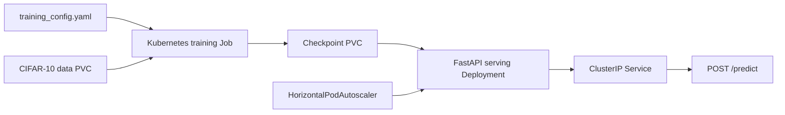

# MLOps PyTorch Pipeline

An end-to-end CIFAR-10 image-classification pipeline that trains a CIFAR-adapted
ResNet-18, packages training and inference in separate Docker images, and runs
both workloads on Kubernetes.

## Architecture



The training process logs one JSON object per line, stops early when validation
loss no longer improves, and stores the best checkpoint. The serving API loads
that checkpoint and exposes health and prediction endpoints.

## Repository layout

```text
.
|-- .github/workflows/ci.yml
|-- configs/
|   |-- smoke_config.yaml
|   `-- training_config.yaml
|-- docker/
|   |-- Dockerfile.serve
|   `-- Dockerfile.train
|-- docs/
|-- k8s/
|-- requirements/
|-- scripts/create_test_image.py
|-- src/
|   |-- dataset.py
|   |-- model.py
|   |-- serve.py
|   `-- train.py
`-- tests/
```

## 1. Local setup with the MLDL environment

Open an Anaconda/Miniconda PowerShell prompt in the repository root:

```powershell
conda activate MLDL
python --version
python -m pip install --upgrade pip
python -m pip install -r requirements/dev.txt
python -c "import torch; print('torch:', torch.__version__, 'cuda:', torch.cuda.is_available())"
```

Python 3.10 or later is required. The Docker images use Python 3.11. Dependency
versions are pinned so local, CI, and container behavior remains reproducible.

## 2. Unit tests and local smoke test

```powershell
python -m compileall -q src tests scripts
python -m pytest -q
python -m src.train --config configs/smoke_config.yaml
```

The smoke configuration downloads CIFAR-10 on first use, trains on 128 samples,
and writes `checkpoints/classifier_smoke.pt`. For the required full run:

```powershell
python -m src.train --config configs/training_config.yaml
```

Each metric line is valid JSON, for example:

```json
{"epoch": 1, "train_loss": 1.92, "train_accuracy": 0.31, "val_loss": 1.61, "val_accuracy": 0.42}
```

## 3. Run the API locally

Generate a deterministic test image and point the API at a checkpoint:

```powershell
python scripts/create_test_image.py
$env:MODEL_PATH = (Resolve-Path checkpoints/classifier_smoke.pt).Path
python -m uvicorn src.serve:app --host 127.0.0.1 --port 8080
```

In a second prompt with `MLDL` active:

```powershell
curl.exe -i http://localhost:8080/health
curl.exe -X POST http://localhost:8080/predict -F "image=@test_image.png"
```

A successful prediction returns `predicted_class`, `predicted_index`,
`confidence`, and a probability for each of the ten CIFAR-10 classes.

## 4. Docker validation

Docker Desktop must be running. Build the required images:

```powershell
docker build -f docker/Dockerfile.train -t mlops-train:v1 .
docker build -f docker/Dockerfile.serve -t mlops-serve:v1 .
```

Run the short containerized training check with mounted configuration, data, and
checkpoint directories:

```powershell
New-Item -ItemType Directory -Force data, checkpoints | Out-Null
docker run --rm `
  -e CONFIG_PATH=/app/configs/smoke_config.yaml `
  -v "${PWD}/configs:/app/configs:ro" `
  -v "${PWD}/data:/app/data" `
  -v "${PWD}/checkpoints:/app/checkpoints" `
  mlops-train:v1
```

For final evidence, omit the `CONFIG_PATH` override so the image uses the full
training configuration and creates `classifier_v1.pt`:

```powershell
docker run --rm `
  -v "${PWD}/configs:/app/configs:ro" `
  -v "${PWD}/data:/app/data" `
  -v "${PWD}/checkpoints:/app/checkpoints" `
  mlops-train:v1
```

Start serving and verify both endpoints:

```powershell
docker run --rm --name mlops-serve -p 8080:8080 `
  -v "${PWD}/checkpoints:/app/checkpoints:ro" `
  mlops-serve:v1

# Run these in another prompt:
docker inspect --format "{{.Config.User}} {{.State.Health.Status}}" mlops-serve
curl.exe -i http://localhost:8080/health
curl.exe -X POST http://localhost:8080/predict -F "image=@test_image.png"
```

The inspection output should identify user `app` and eventually report
`healthy`.

## 5. Docker Desktop Kubernetes validation

In Docker Desktop, open **Settings > Kubernetes**, enable Kubernetes, and wait
until it reports that the cluster is running. Allocate at least 2 CPUs and 6 GiB
of memory to Docker Desktop because the training Job requests 2 CPUs and 4 GiB.

```powershell
kubectl config use-context docker-desktop
kubectl cluster-info
kubectl get nodes
```

The Kubernetes cluster uses images in Docker Desktop's local image store, so the
manifests use `imagePullPolicy: IfNotPresent`.

Apply the training resources in the required order:

```powershell
kubectl apply -f k8s/namespace.yaml
kubectl apply -f k8s/configmap.yaml
kubectl apply -f k8s/training-job.yaml
kubectl get pvc -n ml-training
kubectl get pods -n ml-training -w
```

After the training pod appears, stream its structured logs and wait for success:

```powershell
kubectl logs -f job/pytorch-training -n ml-training
kubectl wait --for=condition=complete job/pytorch-training -n ml-training --timeout=90m
```

Deploy the serving layer only after the Job has completed:

```powershell
kubectl apply -f k8s/serving-deployment.yaml
kubectl apply -f k8s/serving-service.yaml
kubectl apply -f k8s/hpa.yaml
kubectl rollout status deployment/model-serving -n ml-training --timeout=10m
kubectl get pods,service,hpa -n ml-training
kubectl describe deployment model-serving -n ml-training
```

If `kubectl top nodes` reports that the Metrics API is unavailable, install
Metrics Server before assessing HPA metrics:

```powershell
kubectl apply -f https://github.com/kubernetes-sigs/metrics-server/releases/latest/download/components.yaml
kubectl patch deployment metrics-server -n kube-system --type=json `
  -p='[{"op":"add","path":"/spec/template/spec/containers/0/args/-","value":"--kubelet-insecure-tls"}]'
kubectl rollout status deployment/metrics-server -n kube-system
kubectl top nodes
```

Port-forward the service in one prompt:

```powershell
kubectl port-forward svc/model-serving 8080:80 -n ml-training
```

Then test from another prompt:

```powershell
curl.exe -i http://localhost:8080/health
curl.exe -X POST http://localhost:8080/predict -F "image=@test_image.png"
```

To rerun training, delete only the completed Job, then reapply its manifest. The
PVCs retain downloaded data and the checkpoint:

```powershell
kubectl delete job pytorch-training -n ml-training
kubectl apply -f k8s/training-job.yaml
```

## Configuration

`CONFIG_PATH` selects the training YAML. `MODEL_PATH` selects the serving
checkpoint. Kubernetes mounts its ConfigMap at `/app/configs`, CIFAR-10 data at
`/app/data`, and the trained model at `/app/checkpoints/classifier_v1.pt`.

## Optional GPU bonus

For an NVIDIA-enabled cluster, add `nvidia.com/gpu: "1"` to the trainer's
resource limits and select a GPU node, for example:

```yaml
resources:
  limits:
    nvidia.com/gpu: "1"
nodeSelector:
  accelerator: nvidia
```

The cluster must already have compatible NVIDIA drivers and the NVIDIA device
plugin. The default submission remains portable and CPU-only.

## Submission evidence

Follow [docs/validation.md](docs/validation.md) while capturing genuine terminal
output or screenshots. Review [docs/submission-checklist.md](docs/submission-checklist.md)
before submitting the public repository URL, final PR URL, and personalized
reflection.

